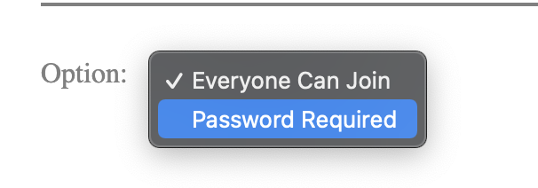

# Module Requirement

[Detail](https://classes.engineering.wustl.edu/cse330/index.php?title=Module_6)

# How to launch the server?

go to the project directory, then run the following command:

```console
$ npm install
$ node server.js
```

# How to open the web page in browser?

After the server is launched, enter `localhost:8080` in the browser url address input line

# Tip

Users could have the same nickname, but each user would have a unique id; same as the room

# How to create a room or a private room?

There is a plus button on the top left side of the window, click it would popover a room creation form; and in that form, you could choose make the room public or private, if private, you have to enter a password:





# How to send private message?

There is a message receiver selection menu in each room:


# How to kick out or block a room member?

If you are the room creator, there would be a button beside the member row:


Click this button would popover a menu that could let room creator block or kick out a member:


# Creative Portion

## feature 1

Users could send Images:


## feature 2

 Inappropriate words filter:


